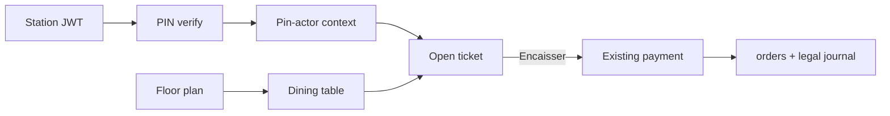

# 455 — Floor service (plans de tables) + soft badge PIN — Plan

Date: 2026-08-13  
Branch: `development` only (does not block `main` production deploy)  
Product goal: table maps + open tickets + software waiter badge with **no hardware**

---

## 1) Goal

Deliver a floor-service stack that matches the MuseBar selling point: **subscription (+ optional bridge/Pi for printers), no badge readers / keys / proprietary tills**.

| Capability | Meaning |
|------------|---------|
| **Plans de tables** | Easy visual floor map editor + POS map picker |
| **Open tickets** | Mutable carts bound to tables until payment |
| **Soft badge (PIN)** | Fast PIN identifies a **user profile** with existing permissions |

Fiscal rule: open tickets are **not** CA. Legal sale starts only when payment hits the existing `orders` + journal path.

---

## 2) Identity model (agreed)

| Layer | What | Job |
|-------|------|-----|
| **Station JWT** | Shared device login (often admin) | Broad UI / “this tablet may run MuseBar” |
| **PIN → membership profile** | Same users + roles + `user_permissions` | Who is acting + whether they may do the action |

- Permissions stay **per profile**, not per PIN string.
- PIN is membership-scoped (`user_establishment_memberships`): one PIN per user-in-venue.
- Shared cashier: station may be logged in as admin; **sensitive actions and all table flows ask for PIN**.
- Two PIN modes (same pad):
  1. **Identify** — tables / traceability / per-worker CA later
  2. **Authorize** — action allowed only if that profile holds the required permission

Long-term UI direction: widen what the station JWT can *see*; move real gates to **PIN actor permissions** for selected actions (cancel, menu edit, …). Inventory of which actions migrate is a **later pass** — Phase A/B ship identify + table stack first.

Seasonal staff: create user + default staff role + set PIN (easy template later). No parallel “waiter_profiles” permission world.

---

## 3) Domain model

| Entity | Role |
|--------|------|
| `floor_plans` | Named layout per establishment |
| `dining_tables` | Label + geometry on a plan |
| `open_tickets` | Mutable cart on a table; status `open` → `closed` / `cancelled` |
| `open_ticket_items` | Line payload aligned with `order_items` (options as JSONB in Phase A) |
| Membership PIN columns | `pin_hash`, lockout counters |

Attribution on tickets/orders: `opened_by_user_id`, `last_served_by_user_id`, and on paid order a **snapshot** (user id + display name + table label) so reports survive renames.

---

## 4) Phases

### Phase A — Foundations (this implementation wave)

- Migrations: PIN on memberships + floor/ticket tables + RLS + `manage_floor_plan` permission
- PIN set / clear / verify → short-lived **pin-actor token** + permissions list
- CRUD floor plans + dining tables
- Open ticket CRUD (create on table, get, replace items, abandon); one open ticket per table
- Backend tests; no full POS map UI yet (stub remains until Phase B)
- Patch note implementation `456`

### Phase B — POS usable in one room

- Badge strip + PIN pad; hold pin-actor token in station memory
- Wire **Sélectionner une table** → map modal
- Cart bound to open ticket; encaisser → existing payment → create order → close ticket
- Bar mode unchanged when no table selected

### Phase C — Service ops

- Transfer table / waiter, merge tickets, real **À suivre**
- History filter by waiter; per-worker sales views (not separate fiscal closure yet)

### Phase D — Polish

- Multi-plan switcher, editor UX, stronger multi-station sync
- Waiter day report; optional closure *report* filters (fiscal closure stays establishment-wide)

**Out of v1:** NFC hardware, seat-level ordering, full KDS course firing, splitting one table across two fiscal registers.

---

## 5) Phase A API sketch

| Method | Path | Notes |
|--------|------|-------|
| `POST` | `/api/auth/pin/verify` | Body `{ pin }` → actor profile + `pin_actor_token` |
| `POST` | `/api/auth/pin/set` | Manager (`access_user_management`) sets PIN for a membership user |
| `DELETE` | `/api/auth/pin/:userId` | Clear PIN (manager) |
| `GET/POST` | `/api/floor/plans` | List / create |
| `PATCH/DELETE` | `/api/floor/plans/:id` | Update / delete |
| `GET/POST` | `/api/floor/tables` | List (optional `plan_id`) / create |
| `PATCH/DELETE` | `/api/floor/tables/:id` | Update / delete |
| `GET` | `/api/floor/status` | Tables + open-ticket summary for map |
| `POST` | `/api/floor/tickets` | Open ticket on free table (requires pin actor) |
| `GET` | `/api/floor/tickets/:id` | Ticket + items |
| `PUT` | `/api/floor/tickets/:id/items` | Replace line set |
| `POST` | `/api/floor/tickets/:id/abandon` | Cancel open ticket (pin actor; permission rules later) |

PIN defaults: **6 digits**, manager-set, bcrypt hash, membership lockout mirrored from login policy.

---

## 6) Permissions

| Key | Use |
|-----|-----|
| Existing profile permissions | Authorize mode after PIN |
| `access_pos` | Use POS / open tables (via pin actor) |
| `access_user_management` | Set/clear PINs |
| `manage_floor_plan` | Edit plans/tables (station JWT or admin for Phase A) |
| `orders_cancel`, `access_menu`, … | Later PIN-authorize migration list |

Phase A: floor **editor** gated by `manage_floor_plan` (or establishment_admin). Floor **runtime** ticket mutations require valid pin-actor token with `access_pos`.

---

## 7) Success criteria

**Phase A:** schema + APIs + tests; PINs settable; plans/tables/tickets work via API.  
**Phase B (product):** manager draws a plan quickly; waiter badges in ~2s; open table → add → pay with existing flows; second waiter sees occupied; zero new hardware; `main` deploy unaffected.

---

## 8) Non-goals / risks

- Do not merge this wave to `main` until Phase B is tested in a real venue.
- Do not fork payment/kitchen paths — reuse existing create-order pipeline when closing tickets.
- Concurrent stations: Phase A/B = refetch/poll; websockets later.
- Permission-gate migration off JWT must be explicit per action (documented when done).

---

## 9) Verification (Phase A)

1. Migrations apply clean (`migration:migrate` / rollback smoke).
2. Set PIN → verify → receive token + permissions; wrong PIN lockout after N fails.
3. Create plan + tables; open ticket; replace items; abandon; cannot open second ticket on same table.
4. RLS: cross-establishment access blocked under tenant context.
5. Index regenerated; `DEVELOPMENT-STATE.md` notes floor-service in progress on `development`.
