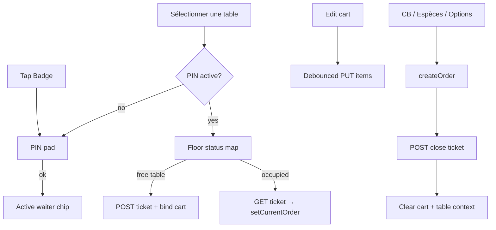

# 457 — Floor service Phase B (POS badge + map + open tickets) — Plan

Date: 2026-08-13  
Branch: `development`  
Prior: Phase A APIs — patch notes `455` / `456`

---

## 1) Goal

Make floor service **usable on the POS** in one room:

1. Soft-badge PIN pad + active waiter strip  
2. **Sélectionner une table** → floor map (status colors)  
3. Cart bound to an open ticket (sync lines)  
4. Encaisser via existing payment → create order → close ticket  
5. Bar mode unchanged when no table is selected  

No hardware. Station JWT stays shared; PIN identifies the acting profile.

---

## 2) Scope

### In scope

| Surface | Work |
|---------|------|
| API client | `services/api/floor.ts` + pin verify; `x-pin-actor-token` on mutating calls |
| PIN UX | Numeric pad dialog; badge chip on POS (display name / Badge) |
| Map UX | Dialog: tables from `GET /floor/status`; free → open ticket; occupied → load ticket into cart |
| Cart bind | Debounced `PUT /floor/tickets/:id/items` while a ticket is active |
| Pay | After successful `createOrder`, `POST /floor/tickets/:id/close` with `order_id`, then clear ticket + cart |
| Setup UX (minimal) | If no plans exist, map shows empty state (“Créer un plan en Administration” later; Phase B may include a tiny “Créer plan + tables” admin shortcut only if already trivial — prefer empty state + note) |

### Out of scope (Phase C+)

- Floor plan visual editor drag-canvas in Admin  
- Transfer / merge / À suivre  
- Migrating cancel/menu to PIN-authorize  
- Multi-station websockets  

---

## 3) UX flows

**Rules**

- Opening/loading a table requires an active pin-actor token; otherwise open PIN pad first.  
- No table selected → today’s bar flow (local cart only).  
- Leaving a table without paying keeps the open ticket server-side; clearing the cart while on a table should sync empty items (or prompt — Phase B: sync empty, stay bound until “Libérer” / pay / abandon).  
- Phase B abandon: optional “Abandonner” on map for occupied table under active PIN (calls abandon API).

---

## 4) State (POS-scoped)

Hold in a `useFloorService` hook (used by `POSContainer`):

- `pinActor: { token, userId, displayName, permissions } | null`  
- `activeTable: { id, label, planId } | null`  
- `activeTicketId: number | null`  
- dialogs: `pinOpen`, `mapOpen`

Session storage optional for pin token (survive refresh on same tablet) — Phase B: **sessionStorage** key `mosehxl.pinActor`.

---

## 5) Files to touch

- New: `services/api/floor.ts`, `hooks/useFloorService.ts`, `components/POS/PinPadDialog.tsx`, `components/POS/FloorMapDialog.tsx`, badge strip component  
- Update: `POSContainer`, `POSOrderPanel`, `OrderSummary`, `apiService` / `api/core` if needed for custom headers  
- Docs: this plan + implementation `458`

---

## 6) Verification

1. Set a PIN via API (or temporary Admin later); badge-in on POS.  
2. Create a plan + tables via API if none; open map; open free table; add products; lines persist after refresh of ticket GET.  
3. Quick CB pay → order created, ticket closed, cart cleared, table free again.  
4. Without PIN, table button prompts PIN first.  
5. Without table, quick pay still works as before.

---

## 7) Success

Waiter badges in ~2s, opens a table, serves, pays with existing flows — selling point visible on `development` without touching `main`.
