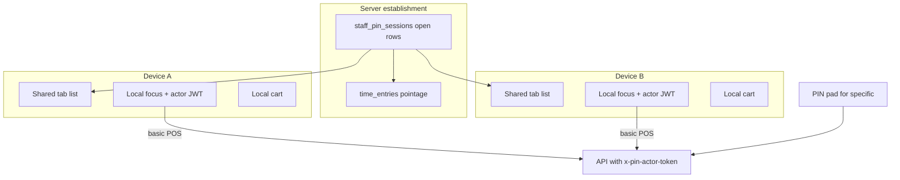

# 549 — Cross-device shared PIN sessions + always step-up for specific rights (PLAN)

## Context

PIN **pointage** is already establishment-wide (`staff_pin_sessions` + clock-in/out on
open/close). The **header badge tabs**, focused actor token, and cart live in
`sessionStorage` on one browser only. Cashiers fear (correctly) that syncing tabs
across tablets without stronger step-up would let anyone use a manager badge that
was opened elsewhere.

Product decision (locked):

1. **Active badges are shared** — any device on the venue sees the same open
   sessions (aligned with pointage).
2. **Basic POS** (rights held by every badge / `PERMISSION_TIERS === 'basic'`)
   uses the **locally focused** badge **without** re-entering PIN on every click.
3. **Specific permissions** always show a PIN pad — even if the focused badge
   already holds that right (`ensurePermission` / `ensureAccess` must not
   short-circuit on the active actor).
4. **Focusing** a badge that is not yet unlocked on this device requires that
   person’s PIN (identity match), not silent inheritance of a remote tab.

## Current state (baseline)

| Concern | Today |
|---------|--------|
| List open badges | `GET /api/auth/pin/sessions` exists; UI barely uses it for tabs |
| Open on verify | Always `INSERT` + clock-in (`openPinSession`) — second device can double-open / double clock-in |
| Tab UI | `PinSessionsContext` + `sessionStorage` (`mosehxl.pinSessions.v1`) |
| Step-up | `StepUpAuthContext.requestElevation` returns active actor if it already has the permission — **no PIN** |

## Locked rules

1. **One open server session per PIN user per establishment.** Re-verify on
   another device reuses the existing open `staff_pin_sessions` row (refresh
   `last_seen_at` / `expires_at`, issue a new `pin_actor_token` with same `sid`).
   Do **not** clock-in again if already clocked in for that user.
2. **Close** remains the only clock-out; still blocked when the actor has open
   floor tickets (existing rule).
3. **Device-local focus** — each terminal has at most one focused badge with a
   live actor token. Remote tabs are visible but inert until PIN unlock on that
   device.
4. **Device-local cart / active table** stay on the device (keyed by server
   `pin_session_id` when possible). Syncing carts across devices is out of scope.
5. **Specific = always PIN.** Use `isSpecificPermission` / `PERMISSION_TIERS` from
   `@mosehxl/types`. Any PIN that holds the right may authorize (same as today’s
   override model) — not necessarily the focused badge’s PIN.
6. **Basic = no re-PIN** while a badge is focused and its actor token is valid.
7. Venue JWT remains shell-only; feature APIs still require PIN actor middleware.

## Architecture

### Backend

- **`openPinSession` / verify path:** if an open non-expired session exists for
  `(establishment_id, pin_user_id)`, return that id; touch `last_seen_at` and
  extend `expires_at`; skip `clockInOnPinOpen` when already clocked in.
- Keep `GET /auth/pin/sessions` as source of truth for the shared list (optional:
  include `permissions` summary or role label for UI — only if needed; avoid
  leaking unnecessary PII).
- No change to legal-journal hash actor rules.

### Frontend

- **Sync:** poll (or focus/visibility refresh) `listActivePinSessions`; merge into
  header tabs. Distinguish “unlocked on this device” (local actor token for that
  `sid`) vs “remote only”.
- **Focus remote tab → PIN pad** constrained to that `user_id` (verify then attach
  local actor; reuse server `sid`).
- **New open:** existing PIN pad → verify → appears on all devices after sync.
- **`StepUpAuthContext`:** for specific permissions, **always** open the pad
  (remove short-circuit when `activeSession` already holds the right). Keep
  short-circuit only for basic if any code path uses ensure* for basic (prefer
  not calling ensure* for basic POS at all).
- **Storage:** stop treating sessionStorage as the source of who is open;
  store only device-local focus + actor tokens + carts keyed by `sid`.

## Slices

| Slice | Patch | Scope |
|-------|-------|--------|
| A | 550 | Always step-up for **specific** permissions in `StepUpAuthContext` (+ tests); audit call sites that relied on silent short-circuit |
| B | 551 | Server: reuse one open `staff_pin_sessions` per user; no double clock-in on re-verify |
| C | 552 | Frontend: shared tab list from API, focus-requires-PIN, device-local cart/focus storage reshape |
| D | 553 | Polish: poll/visibility refresh, empty/expired UX, skill + CHANGELOG + manual cross-device checklist |

PLAN **549**; implementations **550–553**.

## Out of scope

- Syncing carts / open tickets UI state across devices.
- WebSocket push (polling is enough for v1).
- Requiring PIN for every basic POS action.
- Changing which keys are `basic` vs `specific` in `PERMISSION_TIERS` (unless a
  gap is found during audit — then a tiny follow-up).
- Offline PIN / offline pointage.

## Verification

### Automated

- [ ] Unit: `requestElevation` / ensurePermission always prompts for a specific key even when active actor has it
- [ ] Unit/integration: second verify for same user returns same `sid`, single open time entry
- [ ] Frontend tests for merge of server list + local unlock map
- [ ] `npm test` / type-check for touched workspaces

### Manual

- [ ] Open badge on caisse → appears on tablet list without clocking in twice
- [ ] On tablet, tap that badge → PIN required → then basic POS works
- [ ] Specific action (e.g. remise / cancel) → PIN every time, even as manager focused
- [ ] Close badge on one device → disappears everywhere after refresh; clock-out once
- [ ] Cannot close while open tables (unchanged)

## Risks

| Risk | Mitigation |
|------|------------|
| Double clock-in from multi-device verify | Slice B reuse + skip clock-in if open entry exists |
| Friction if too many actions marked specific | Stick to `PERMISSION_TIERS`; only reclassify with product sign-off |
| Stale tab list | Poll on interval + window focus; close/open triggers immediate refetch |
| Actor token on device A after close on B | Close revokes server session; next API call fails → force local unlock clear on 401/session errors |
| Cart loss when reshaping storage | Migrate sessionStorage shape carefully; one-device carts only |

## Fiscal impact

**MINOR** — session/pointage UX and authorization prompts; legal journal actor
trace rules unchanged; no ISCA parameter change.

## Follow-ups (later)

- Optional WebSocket / SSE for instant tab sync.
- Optional “PIN confirm must match focused badge” mode (stricter than any
  holder of the right) — not requested now.
